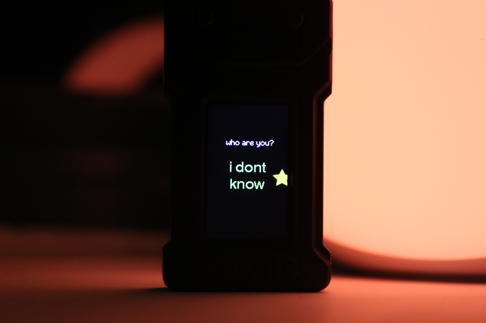

# CES Generative Art Installation
Creative Embedded Systems, Spring 2026

This project is a generative art installation that explores existential themes through random visual and textual combinations. It displays existential questions and randomly selected answers against a dynamic, drifting star background. 

The installation is built on a foundation of **randomness**:
1.  **Initial State:** On power-up, the system always starts with the first question ("what do you want to be") to establish a consistent entry point.
2.  **Generative Flow:** After the first display cycle, the system **randomly selects** the next question from the pool.
3.  **Answer Generation:** For every question shown, the system **randomly picks** a unique answer from a specific pool of choices.
4.  **Transitions:** Transitions are deterministically mapped to specific question pairs (e.g., Question A to B always uses a "Slide" transition), but because the *order* of questions is random, the resulting visual sequence remains unpredictable and generative.

## Generative Content
The installation cycles through the following possible states:

| Question | Possible Answers |
| :--- | :--- |
| **"what do you want to be"** | brave, happy, confident, successful, loving |
| **"are you who you want to be"** | yes, no, huh?, i guess |
| **"who are you"** | i am me, i am you, i dont know, am i supposed to know? |

### Code: Randomness Logic
The system uses the ESP32's hardware random number generator to ensure a unique sequence of answers and question paths:

```cpp
int pickNextChoice(int current) {
  int next = random(0, 3);
  while (next == current) next = random(0, 3);
  return next;
}

const char* pickAnswer(int choice) {
  switch (choice) {
    case CHOICE_A: return answersA[random(0, answersA_count)];
    case CHOICE_B: return answersB[random(0, answersB_count)];
    case CHOICE_C: return answersC[random(0, answersC_count)];
  }
  return "";
}
```

### Code: Sine-Wave Star Drift
The background features a star that drifts across the screen. To make the movement feel more "organic," a sine-wave offset is applied perpendicular to its drift direction:

```cpp
void updateStar() {
  starBaseX += starDirX;
  starBaseY += starDirY;

  starSineT += starSineSpd;
}

void drawStar() {
  float sineOffset = sin(starSineT) * starSineAmp;
  int drawX = (int)(starBaseX + starPerpX * sineOffset);
  int drawY = (int)(starBaseY + starPerpY * sineOffset);

  starSprite.pushToSprite(&background, drawX, drawY, TFT_BLACK);
}
```

## Materials
*   **LILYGO T-Display ESP32 (TTGO T1):** The primary microcontroller and display unit.
*   **3.7V 150 mAh 0.6 Wh LP401730 Battery:** Powers the device for portable use.
*   **USB-C Cable/Charger:** Used for programming the chip and charging the battery.

## Software & Tools Required
*   **VS Code** with the **PlatformIO** extension.
*   **Arduino Framework** for ESP32.
*   **TFT_eSPI Library:** Used for high-performance graphics and sprite handling.

## Reproducibility Instructions
1.  **Clone the repository:** 
    ```bash
    git clone https://github.com/[your-username]/ces-generative-art-installation.git
    ```
2.  **Open in VS Code:** Launch VS Code and open the project folder. Ensure the PlatformIO extension is active.
3.  **Library Configuration:** The project uses `TFT_eSPI`. The `platformio.ini` is already configured to include the correct setup for the LILYGO T-Display via build flags:
    ```ini
    build_flags =
      -D USER_SETUP_LOADED=1 
      -include $PROJECT_LIBDEPS_DIR/$PIOENV/TFT_eSPI/User_Setups/Setup25_TTGO_T_Display.h
    ```
4.  **Build and Upload:** Connect your LILYGO T-Display via USB-C and use the PlatformIO "Upload" button to compile and flash the firmware.

## Installation / Assembly Instructions
1.  **Battery Connection:** Plug the 3.7V LP401730 battery into the JST connector on the back of the LILYGO T-Display.
2.  **Power:** The device will power on as soon as the battery is connected or when plugged into a USB-C power source.
3.  **Charging:** To charge the battery, simply connect the device to a USB-C charger.

## Usage Instructions
1.  Once powered, the screen will initialize and begin the generative sequence.
2.  **Display Cycle:** The screen shows a question (e.g., "who are you?") followed by a randomly chosen answer.
3.  **Transitions:** Every 4 seconds, the display will trigger a random transition effect to a new question/answer pair.
4.  **Background:** A star will continuously drift across the screen in a sine-wave pattern.

## Final Product 


## Photos!


